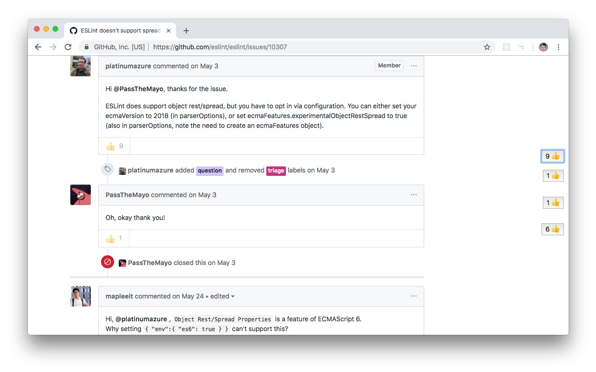

# Usage

Install **Github issues scroll jump** directly from the [Chrome Webstore](https://chrome.google.com/webstore/detail/offgcfiinamnilehfkecgjolghooioem)

# What is it?

It's annoying to have to scroll through dozens of comments in a github issue thread if you're just looking for that one comment where someone provided a workaround or the solution. Unlike StackOverflow, github issue threads aren't sorted by usefulness, even though reactions offer a useful measure of which comment is most helpful.

This is a chrome extension that annotates the scroll bar with the top comments in a github issue thread, allowing you to click or tab between them. It's like skip links for screen readers: you can go straight to the content rather than having to go past a lot of unrelated information.

